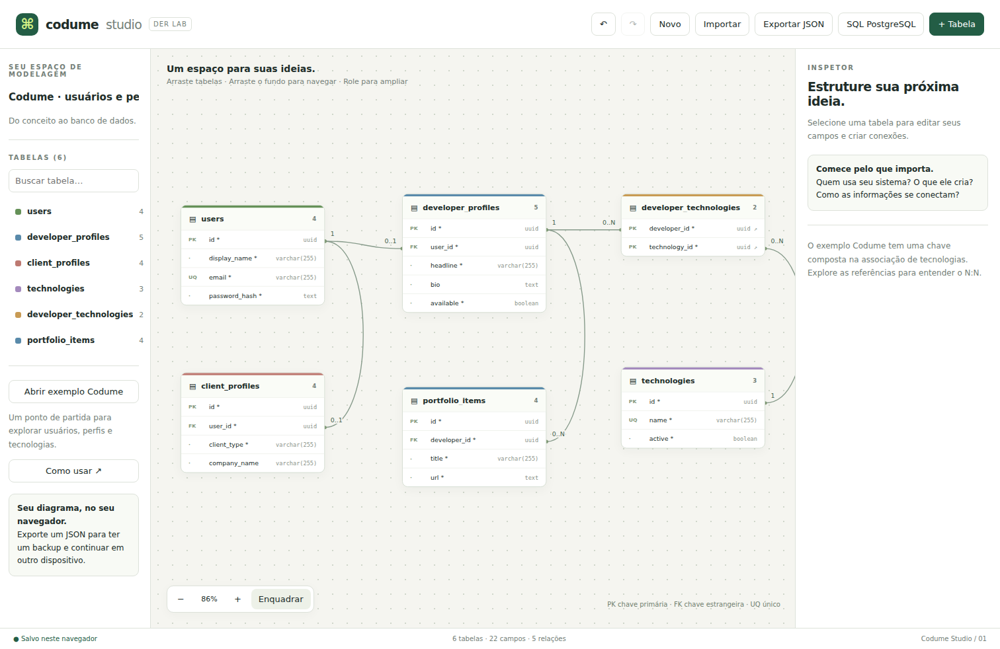

# Codume Studio

Editor visual de DER com HTML, CSS e JavaScript modular. Crie tabelas e relacionamentos, organize o diagrama e exporte JSON ou SQL para PostgreSQL.



## Versão 0.2 — código para estudar

Esta versão reorganiza o protótipo de arquivo único em módulos JavaScript nativos, com comentários e testes incluídos. A interface e o formato JSON v1 foram preservados. A implementação inicial e esta refatoração foram feitas com auxílio do Codex.

**Comece pelo [guia de leitura de código](docs/GUIA-DE-CODIGO.md).** Ele acompanha a criação de uma tabela linha por linha, depois explica validação, histórico, renderização, arquivos e arraste.

## Abrir no computador

Com Node.js 22 ou superior instalado, abra o terminal na pasta extraída e execute:

```bash
npm start
```

Acesse **http://127.0.0.1:8000**. Não é necessário executar `npm install` para abrir o aplicativo: o servidor usa somente recursos nativos do Node.

Alternativa para quem já tem Python:

```bash
python -m http.server 8000 --bind 127.0.0.1
```

Nesse caso acesse **http://127.0.0.1:8000**. No Windows o comando pode ser `py -m http.server 8000 --bind 127.0.0.1`.

**Não abra esta versão por duplo clique em `index.html`:** ela usa `type="module"`, `import` e `export`, que precisam ser carregados via servidor HTTP no fluxo suportado. O servidor apenas entrega arquivos; não é uma API e não armazena seu diagrama.

### Trazer seu diagrama da versão anterior

Antes de mudar de versão, exporte JSON no aplicativo antigo. Abra a versão modular e use **Importar**. A chave de armazenamento e o formato são os mesmos, mas `file://`, `localhost` e `127.0.0.1` podem ter áreas de armazenamento diferentes. A importação evita depender desse detalhe do navegador.

## Funcionalidades

- Tabelas arrastáveis, zoom e navegação pelo fundo.
- Edição de nomes, campos, tipos e cores.
- PK, NOT NULL, UNIQUE e FKs simples.
- PK composta e associação N:N usando duas FKs.
- Cardinalidades derivadas das restrições.
- Histórico de até 60 estados para desfazer/refazer.
- Salvamento local e backup em JSON.
- SQL de criação de tabelas e relacionamentos para PostgreSQL.

O exemplo inicial contém seis tabelas de usuários e perfis da Codume; não é o DER completo do marketplace.

## Organização

| Arquivo | Responsabilidade |
| --- | --- |
| `index.html` | Elementos da tela, formulários e diálogos |
| `css/styles.css` | Aparência e layout |
| `js/app.js` | Inicializa e conecta os módulos |
| `js/state.js` | Objeto com o estado atual |
| `js/model.js` | Cria campos e o modelo de exemplo |
| `js/constants.js` | Tipos, cores e chave de armazenamento |
| `js/validation.js` | Verifica integridade do modelo |
| `js/history.js` | Confirma alterações, desfaz e refaz |
| `js/storage.js` | Lê e grava o modelo no armazenamento recebido |
| `js/renderer.js` | Atualiza cartões, lista e inspetor |
| `js/relationships.js` | Desenha conexões e rótulos em SVG |
| `js/viewport.js` | Zoom, deslocamento e enquadramento |
| `js/dialogs.js` | Formulários de tabelas/campos e exclusões |
| `js/events.js` | Botões gerais e eventos delegados do inspetor |
| `js/interactions.js` | Arraste e eventos da área de desenho |
| `js/files.js` | Downloads e nomes dos arquivos exportados |
| `js/sql-exporter.js` | Transforma modelo em SQL |
| `js/dom.js` | Seleção de elementos, escape e mensagens |
| `js/utils.js` | Cópia do modelo e geração de IDs |
| `server.js` | Servidor estático local, sem dependências |
| `tests/` | Testes reproduzíveis |

### Fluxo de uma edição

O evento lê os valores do formulário. `mutate()` cria uma cópia e aplica a alteração. `commit()` valida a cópia e confirma o novo estado. O histórico chama a função `onChange` configurada em `app.js`; ela tenta salvar e renderiza a interface.

O histórico não importa o renderizador. A conexão é feita por callbacks na inicialização, evitando dependência circular. O arraste possui um caminho específico: atualiza coordenadas durante o movimento e registra um snapshot ao terminar.

Esta separação é uma arquitetura modular simples, não uma implementação completa de Clean Architecture. Alguns módulos de interface continuam usando um estado compartilhado e renderização imperativa.

## Testes

Testes de regras, histórico e armazenamento usam o runner nativo do Node:

```bash
npm test
```

Para os testes adicionais, instale as dependências de desenvolvimento:

```bash
npm ci
npx playwright install chromium
npm run test:ui
npm run test:sql
```

O teste de interface inicia e encerra seu próprio servidor local. O teste SQL usa PGlite, um motor PostgreSQL em WebAssembly. Não precisa instalar um servidor PostgreSQL. Nenhuma dessas dependências é carregada no aplicativo.

Em Linux, dependendo do ambiente, a instalação de bibliotecas do navegador pode exigir `npx playwright install --with-deps chromium`.

Variáveis opcionais dos testes: `TEST_PORT` altera a porta do servidor de teste; `CHROMIUM_EXECUTABLE` indica um Chromium já instalado. O padrão do teste usa o navegador instalado pelo Playwright.

Consulte [VERIFICACAO.md](docs/VERIFICACAO.md) para resultados e limites da verificação desta entrega.

## Persistência e limites

O aplicativo não envia modelos a servidores. O modelo é salvo em `localStorage` e inclui posições, cores e referências por IDs. Zoom, seleção e histórico não persistem após recarga. Exportar JSON regularmente é necessário para backup; várias abas não coordenam suas gravações.

Mantidos nesta versão:

- Até 100 tabelas, 100 campos por tabela e importação de 2 MB; esses limites não garantem desempenho máximo.
- Tipos predefinidos; sem defaults, índices adicionais, checks de negócio ou FK composta.
- SQL para esquema novo, não migrations incrementais; não executa SQL no banco do usuário.
- Sem backend, contas, sincronização, colaboração ou importação SQL.
- Layout prioriza desktop; acessibilidade e experiência móvel ainda podem melhorar.
- Conexões SVG com roteamento simples; podem se sobrepor em diagramas densos.

## Próximas evoluções

- Melhorar a acessibilidade por teclado.
- Separar componentes maiores de renderização quando necessário.
- Ampliar testes de combinações de restrições e modelos grandes.
- Automatizar os testes em CI.
- Suportar múltiplos diagramas e novos recursos de modelagem.

React, TypeScript e backend não são necessários para ler ou executar esta versão. Podem ser avaliados conforme o projeto ganhar requisitos.
